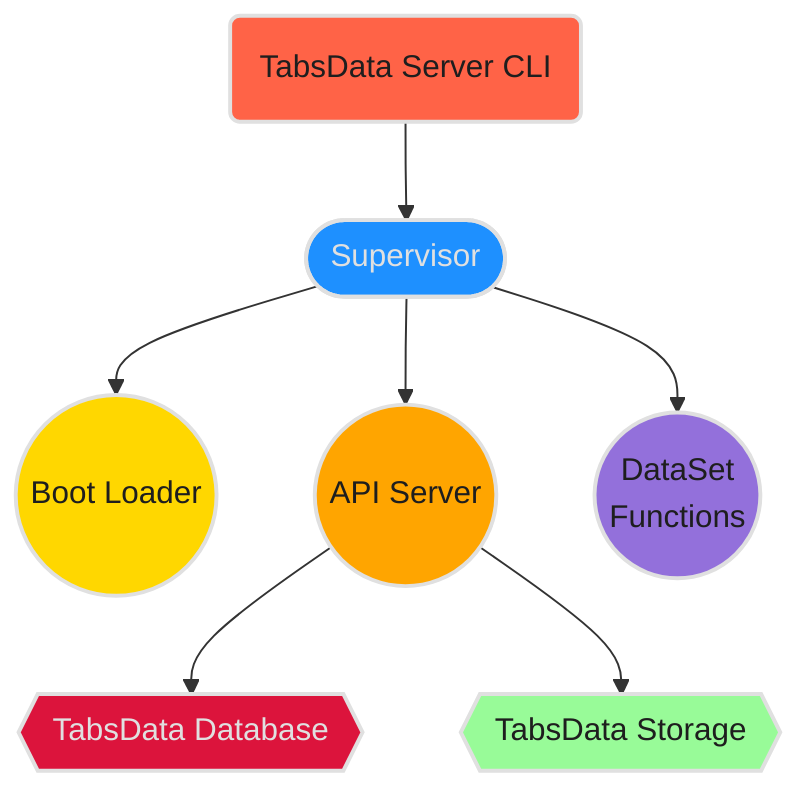
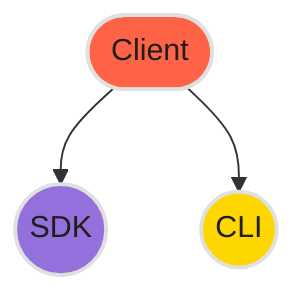

<!--
    Copyright 2024 Tabs Data Inc.
-->

# Architecture

TabsData System (just TabsData or tabsdata in the rest of this document) is a software composed of two main pieces: the
server (on the backend) and the client (on the frontend). The following chapters explain how to get started with these 
components

## TabsData Server

The TabsData Server architecture is based on the ***Erlang/OLTP*** [Supervisor Behaviour](https://www.erlang.org/doc/apps/stdlib/supervisor.html#). The supervisor tree is 
configured using YAML files that specify the processes tree structure in a way portable to ***Kubernetes*** manifest 
descriptors. 

In this, two types of processes exist: 

- **Supervisors**: processes that manage the lifecycle of other processes, and are responsible for restarting them in
  case of failure. They might also do some additional specialized work, mainly focused on the execution orchestration 
  of its managed processes.
- **Workers**: processes that do a specialized task, without any concern about the overall state of the system and its 
               processes.

In terms of their lifecycle, three types of workers exist in TabsData:

- **Regular**: these are the main processes that run the TabsData workload. These processes act as services that provide 
               the core functionalities to other components. They are managed by the supervisor to ensure their continued 
               availability.
- **Initializer**: these are the processes that must be run before any other process. These processes are not recoverable, 
                   meaning that failure of any initializer during the system startup implies automatic system failure and 
                   shutdown.
- **Ephemeral**: these processes share properties of regular processes. Their main difference is that they are not predefined 
                 (although still configured) in the supervisor tree, and are instead created on-demand by other processes or external 
                 systems.

```mermaid
flowchart TD
    supervisor([Supervisor]):::supervisor
    initializer_worker((Initializer Workers)):::initializer
    regular_worker((Regular Workers)):::regular
    ephemeral_worker((Ephemeral Workers)):::ephemeral

    supervisor --> initializer_worker
    supervisor --> regular_worker
    supervisor --> ephemeral_worker

    subgraph EphemeralWorkers["Ephemeral Workers Instances"]
        style EphemeralWorkers fill:#2C3E50,stroke:#E0E0E0,stroke-width:2px;
        instance_i((Worker Instance)):::instance
        instance_m((...)):::instance
        instance_f((Worker Instance)):::instance
    end

    ephemeral_worker --> instance_i
    ephemeral_worker --> instance_m
    ephemeral_worker --> instance_f
    
    classDef supervisor fill:#1E90FF,stroke:#E0E0E0,stroke-width:2px,color:#E0E0E0;
    classDef initializer fill:#FFD700,stroke:#E0E0E0,stroke-width:2px,color:#1E1E1E;
    classDef regular fill:#FFA500,stroke:#E0E0E0,stroke-width:2px,color:#1E1E1E;
    classDef ephemeral fill:#9370DB,stroke:#E0E0E0,stroke-width:2px,color:#1E1E1E;
    classDef instance fill:#FF6347,stroke:#E0E0E0,stroke-width:2px,color:#1E1E1E;
```

The current TabsData supervisor tree is depicted below:

- The worker **Boot Loader** is responsible for preparing the environment setup so that the supervisor
  and the workers can run correctly.
- The worker **API Server** takes care of serving all the API requests that provide security, persistence 
  and scheduling functionalities to the system. DataSet Functions are triggered through the **Scheduler** 
  running inside the API Server.
- The worker **DataSet Functions** is responsible for starting and configuring the workers that will execute
  DataSet functions, thus make data evolve through time.

The TabsData Server provides a commandline tool (`tdserver
`) to interact with it. It allows to manage 
TabsData instances. 

## TabsData Client

The TabsData Client is composed of two main pieces: 

- **SDK**: this component implements the public available API to programmatically interact with the TabsData System.
           Besides managing all the entities that constitute the TasData ecosystem, it also facilities the 
           automation of task for efficient management of the system. The CLI relies on it. It also contains the 
           **tabsserver** package that allows the DataSets Functions to be executed on the backend. 
- **CLI*: command line tool (**td**) to interact with a supporting TabsData Server in order to register or retrieve 
          components (DataStores, DataSets, Tables, Partitions and Function Bundles, mainly). It allows accessing 
          the API Server services in a handy and simple way. This is a core component that enables publishing datasets
          in the TabsData Server to integrate them with the existing system. Developers use it to deploy artifacts in
          TabsData Server.

**© Copyright 2024 Tabs Data Inc.**