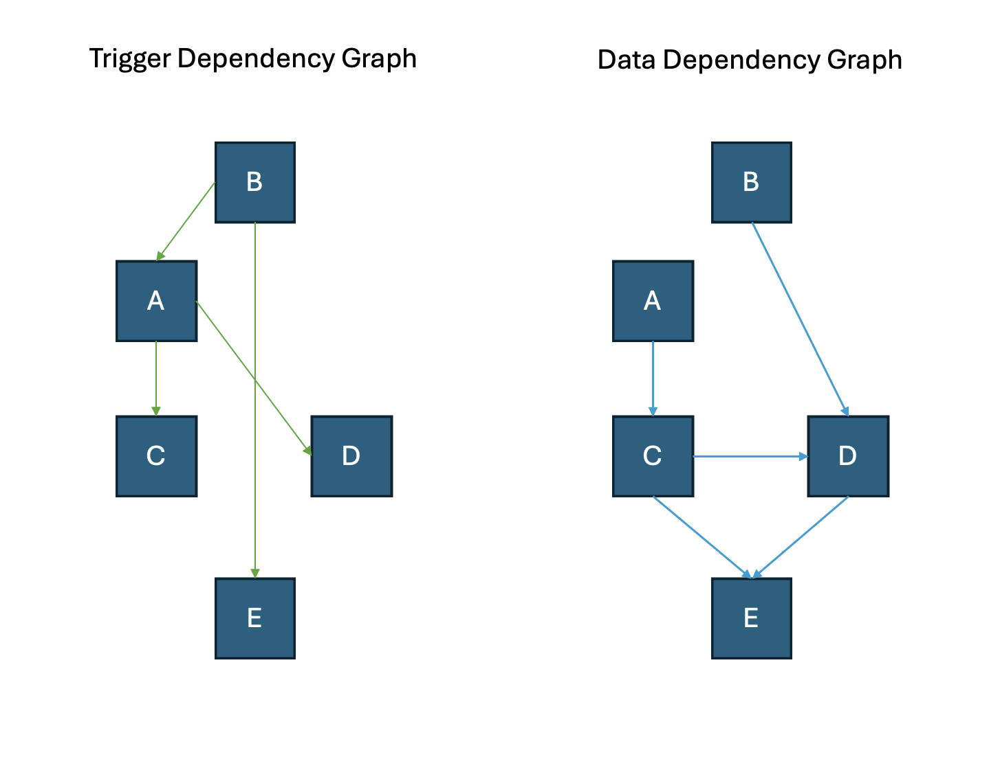

..
    Copyright 2024 Tabs Data Inc.

Advanced Concepts
=========================================================================================================

.. _graph:

Graphs
--------------

Graph is a represetation of how data and trigger dependency flows among different datasets.

.. _graph_image:

   Figure 1: Dependency Graphs

.. _tigger_dependency_graph:

Trigger Dependency Graph
^^^^^^^^^^^^^^^^^^^^^^^^^
This graph represents how different datasets are related to each other via triggers. A dataset can have no triggers or 1 trigger at most.

.. _data_dependency_graph:

Data Dependency Graph
^^^^^^^^^^^^^^^^^^^^^^^^^
This graph represents how different datasets are related to each other via data dependencies. A dataset can have any number of datasets as inputs for data.

In the given example in :ref:`Figure 1 <graph_image>`, any change in dataset B would trigger the dataset function of dataset E. However, the data input for the dataset E doesn't come from dataset B, but only C and D.

.. _pristine_data:

Pristine State
---------------

As data is loaded into a Tabsdata system and is transformed by multiple dataset functions, there will be cases where, as in the above :ref:`Figure 1 <graph_image>`, a dataset (ie E) consumes data from two or more datasets (ie C & D) which in turn consume data from upstream datasets (ie A and B). 

In this scenario, unless explicitly overruled, it is desirable that the consuming dataset (E) uses snapshots of the upstream datasets (C & D) based on the latest upper stream datasets (A and B). This is analogous to what in SQL is referred to as transactional consistency. We refer to this as a pristine state. 

Every dataset within an instance has a notion of a pristine state which is a vector of table versions that together reflect a fully absorbed change from its upstream dependencies. Changes to datasets are executed serially from a queue, with each change resulting in the publishing of a new pristine version that propagates to downstream datasets.

Hence, a pristine state is a view of a dataset dependency graph where all the versions are derived from the same initial upstream snapshots.

If the inputs for a given dataset function have 2 dependency graphs with an empty intersection, then the current versions of the inputs always are ‘pristine’ for the consuming dataset function.

.. _partition:

Partition
--------------

The largest subset of a table where all the data tuples have the same partition key elements. The table partition is identified by the partition key element values.

.. _partition_key:

Partition Key
^^^^^^^^^^^^^
The underlying variable on which the partitions of table are created.

.. _tracing:

Tracing
------------------

.. _lineage:

Lineage
^^^^^^^
<<Doubt: How to define?>>

.. _provenance:

Provenance
^^^^^^^^^^

Every row of every dataset table has a unique ID (ID) and a list of IDs (PROV) of the rows it has been derived from. 

Having row level ID and PROV enables both upstream and downstream navigation. Navigating upstream we can find the sources the row has been created from. Navigating downstream we can find where the row has been used.