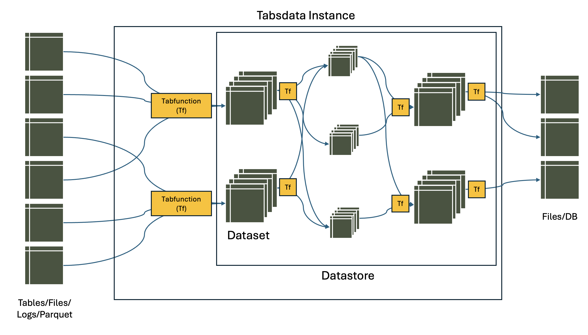

..
    Copyright 2024 Tabs Data Inc.

Core Concepts
=========================================================================================================

.. _acme_inc:

| To explain the concepts better, **let's assume an organization, Acme Inc**. The firm is operating at a reasonable scale with various departments including manufacturing, supply chain, sales, marketing, IT etc.

<<DOUBT: HOW TO INCLUDE PUB-SUB AS A CORE CONCEPT?>>
<<DOUBT: HOW TO THINK ABOUT CROSS-LINKING TERMS ACROSS DOCUMENTS? Once in every doc or linking every occurence?>>

.. _table:

Table
------------------

A table is a view of data organized in rows and columns. It is similar to a spreadsheet or SQL table. Each column has a name and all the values in the column have the same type. 

In the context of :ref:`Acme Inc<acme_inc>`, a Tabsdata Table would represent individual tables concerning marketing campaigns, transaction data, inventory, sales data, etc.

Tabsdata supports all data types supported by `Polars <https://docs.pola.rs/user-guide/concepts/data-types-and-structures/>`_, as listed below:

* Numeric data types: signed integers, unsigned integers, floating point numbers, and decimals.
* Nested data types: lists, structs, and arrays.
* Temporal: dates, datetimes, times, and time deltas.
* Miscellaneous: strings, binary data, Booleans, categoricals, enums, and objects.

*Note: All types support missing values represented by the special value `null`. This is not to be conflated with the special value `NaN` in floating number data types.*

.. _dataset:

Dataset
-------

A dataset is a collection of tables that belong and are updated together. 

Going back to :ref:`Acme Inc<acme_inc>`, a collection of tables including customer data, campaign data, and sales data can together form a marketing dataset.

<<Doubt: Is this example making sense?>>

Also note that tables can belong to multiple datasets. e.g. a customer data table can be a part of sales, supply chain, and many other datasets in Acme Inc.

.. _tabfunction:

Tabfunction
------------------

The tabfunction is a programmatic artifact that produces and modifies data for the tables of the dataset. Every dataset has a tabfunction. A tabfunction takes as input a set of tables (it could be no tables at all, tables from the same dataset or tables from different datasets) and produces as output a set of tables (that will be part of a single dataset).

A tabfunction enables (a) the import of data from external systems into a dataset for further processing, (b) modification of data within datasets, and (c) exporting data from a dataset to external systems.

.. _dataset_version:

Dataset Version
----------------

The output of a successful execution of a tabfunction is called a dataset version. All the datasets within Tabsdata system are dataset versions and are an output of some tabfunction.

Each successful execution of a tabfunction creates a new version of tables for the corresponding dataset. Calling a dataset points to the latest version of a dataset. However, Tabsdata system keeps previous versions of the dataset and the corresponding data for auditing and traceability.

Once created, the data in a dataset version is immutable.

.. _trigger:

Triggers
----------

A trigger specifies when to run the tabfunction to update the data in the dataset. It is the condition that prompts the dataset to refresh and generate a new version.

The triggers are only based on a new version of a certain dataset or table being available and don't support calculation based events.

The triggers are mapped backwards. i.e. B dataset has a trigger on A dataset, or, the tabfunction for B will get triggered, whenever there is an update in the dataset A.

There are two types of triggers: manual triggers and dependency triggers.

.. _mannual_trigger:

Manual Trigger
^^^^^^^^^^^^^^^^

A manual trigger is a trigger that is explicitly activated, for example by calling a URL or issuing an activation command via a CLI. External conditions and periodic execution of a trigger can be easily built on top of manual triggers. For example, using a crontab or a workflow system like Airflow.

A manual trigger is an external action. The evaluation of conditions that activate the manual trigger happens outside of the Tabsdata system.

.. _dependency_trigger:

Dependency Trigger
^^^^^^^^^^^^^^^^^^^^

A dependency trigger is a trigger that is activated by the Tabsdata system because another dataset in the system has produced a new version.

Dependency triggers are internal actions. The Tabsdata system decides when to activate a dependency trigger.

*Note: When a dataset has a dependency on a dataset from a different datastore it is not considered a dependency trigger but a manual trigger that is invoked by the datastore with the upstream dataset.*

.. _datastore:

Datastore
----------

Datastore is a collection of datasets. All access and ownership permissions are managed at datatore level. <<Doubt: What is the corresponding thing in Acme Inc? Is it the departments?>>

.. _server_and_instance:

Server and Instance
--------------------

All datastores, and consequently all data in Tabsdata system, are contained inside an instance of a Tabsdata server.

A Tabsdata server is a binary installation via pip install. When installed a user must create an instance of Tabsdata.

A Tabsdata server can run one or more instances at a time. The user can create, start, stop and delete an instance of Tabsdata.

<<Doubt: How to include the reference of Acme Inc?>>